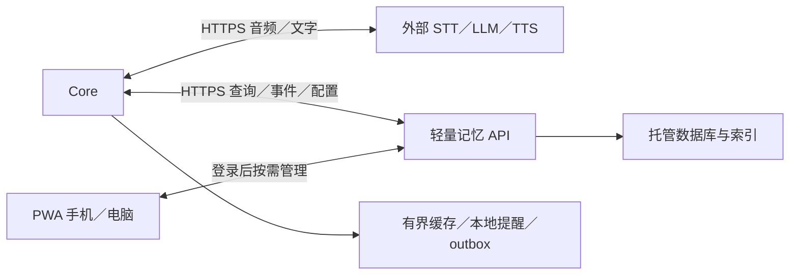

# 总体架构：Core＋云端记忆＋PWA

版本 v0.3，2026-09-09。根据用户最终确认收敛；目前为设计文档，未实现或实测。

## 职责

| 部分 | 负责 |
|---|---|
| Core | 动画、按键、录音播放、直连外部 AI、本地提醒、有限缓存与待同步事件 |
| 外部 AI 服务 | STT（可为 Whisper 服务）、LLM、翻译、TTS、故事文字生成 |
| 云端记忆服务 | 完整主库、来源隔离、检索、事件归档、配置同步、认证、备份 |
| PWA 管理网页 | 角色、声音、模型、记忆、插件、设备管理；可添加主屏幕，用完关闭 |

**直连是网络调用方式，不是把模型放在 Core。手机也不运行或中转语音模型。**



## 技术基线与目录

Core：C++/Arduino、M5Unified、M5GFX、M5Faces；精确版本经 M0 固定。记忆服务：建议 TypeScript 函数＋托管 PostgreSQL＋身份服务，Supabase 等候选需先测实际地区网络再选。PWA：TypeScript/React/Vite，HTTPS 静态部署、manifest、service worker。不要求 Python 全功能后端或原生 App。

```text
firmware/src/hal/          硬件
firmware/src/core/         输入、页面、调度
firmware/src/providers/    外部AI协议
firmware/src/memory/       云API、缓存、outbox
firmware/src/features/     生活、对话、翻译、提醒、旅行
memory-service/functions/ 记忆、认证、配置、同步
memory-service/migrations/数据库和权限迁移
control-center/           PWA源码与静态构建
contracts/                固定协议与JSON Schema
tools/                    Mock、资源转换、诊断
assets/characters/        角色源资源和发布清单
docs/                     文档
```

上述代码目录待实现。所有客户端不得持有数据库管理密钥；Core 只保存本人配置的 AI 凭据和作用域有限的设备令牌。项目不分发共用开发者 AI key。

## 资源与行为

记忆核心新增分层生命周期、真实时间、关系和人格经验、重要性评分与主动回忆，详见 [12专项规格](12-人格关系与分层记忆系统.md)。云端异步整理评分，Core保持有限上下文与最终展示控制；评分不阻塞用户查询，不把故事当事实，不自动改写人格核心。

完整主库不在 Core。缓存≤100条且≤128KiB，Profile≤8KiB，查询≤5条/8KiB，outbox≤200条/256KiB，先到上限者为准。全历史增长不会让 Core 下载全库。录音20秒约625KiB，320×240 RGB565双缓冲约300KiB，另留 TLS/解码/任务栈预算。

网络、写盘与渲染分离；来源在写入和检索两端执行；提醒持久化成功才宣布成功；配置 applied ack 前 PWA 显示待应用。离线基本生活继续，动态 AI 和全历史检索不可用，能用缓存但不假称完整记得。

Wi-Fi 为首版；个人热点只是网络来源；4G/eSIM 后续实测。PWA 无需后台常驻，首次配网走设备限时热点或 USB，不依赖 iPhone Web Bluetooth。

细节见 [直连 AI](09-设备直连开发基线.md)、[云端记忆](11-云端记忆服务开发基线.md)、[PWA模块](modules/M10-control-center/development.md)。
