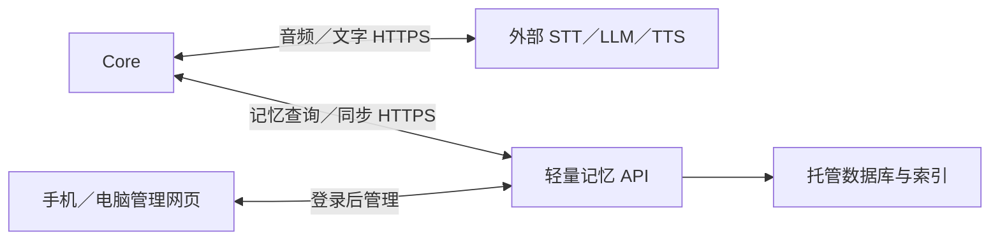

# 云端记忆服务开发基线（当前已确认）

用户最终选择：**云端主库＋Core 有限缓存＋手机/电脑按需管理**。这是长期记忆的主方案。iPhone 主库为可选参考，手机不进入必要实时链路。

## 1. 两条独立链路

不必自建完整音频中转服务器，但仍需实现记忆 API、认证、权限、数据库和管理页。可以使用托管数据库和函数部署，不要求新手自己运维操作系统。托管不等于零代码、零费用或自动保证低延迟。

## 2. 建议技术起点

记忆服务建议 TypeScript serverless functions + 托管 PostgreSQL + 托管身份服务；管理页 TypeScript/React/Vite。Supabase 是可评估候选，提供数据库权限和函数能力，尚未创建账号、项目或购买套餐。[数据库行级权限](https://supabase.com/docs/guides/database/postgres/row-level-security)、[函数](https://supabase.com/docs/guides/functions)

实施前测试用户实际网络到候选区域的连通性、TLS、查询 p50/p95、冷启动和费用，选择后锁定区域和 SDK 版本。数据库尽量与查询函数邻近部署，不能因为称“边缘函数”就假定跨区域查库无延迟。若候选不可达可换等价服务，内部契约保持不变。

## 3. 查询流程

Core STT 得到文本→请求记忆 query→服务按认证限定 companion→来源过滤和检索→最多 5 条/8KiB→Core 拼入当前 LLM 请求。建议总体查询截止 2 秒，含连接建立；超时/服务失败使用 Core 有限缓存。空结果与不可用不同，明确历史问题中按实际范围回答。

记忆结果来自已持久化数据，不在每次查询同步调用额外 LLM 重新写一遍。首版先关键词、日期、标签与可验证的中文检索；语义 embedding 后续作为异步索引，模型和数据版本固定。索引不能绕过来源或用户隔离。

## 4. 主数据与设备预算

云端保存全部 memories、Profile、Recent Context、events、删除记录和版本。Core 仅缓存最多 100 条/128KiB，Profile≤8KiB，单查询≤5条/8KiB；outbox≤200条/256KiB。主库可以增长，设备内存与扫描量保持有界。

未确认上传的事件先落盘；服务事务提交后 ACK；重复 event_id 不重复归档。outbox 满先暂停自动旅行生成和保存，不覆盖旧事件；主动保存失败告知连接同步，基本对话和本地提醒继续。

## 5. 认证与配对

管理网页使用托管身份登录；设备用独立、可撤销、只属于一个 companion 的令牌。首次配对以设备随机 bootstrap 凭据建立短时 code，网页登录认领后必须在设备确认。bootstrap 凭据只可创建配对，不可读记忆。

设备令牌由记忆 API 验证，API 在服务端根据绑定确定 owner/companion，不信任客户端提交的 owner_id。数据库若使用 service role，必须仅在服务端，并执行严格范围检查；浏览器和设备永远不持有数据库管理密钥。[权限说明](https://supabase.com/docs/guides/database/postgres/row-level-security)

网页与设备使用不同权限：网页可编辑删除记忆；设备上传允许类型事件、查询本人记忆和获取配置。所有写入都版本化、限大小、限速、有幂等。服务端不能只检查“token 格式像 JWT”而不验证签名或有效会话。

## 6. 后台归档

首版设备上传结构化事件，服务按规则选择值得留存的记录；源录音不上传记忆 API。AI 生成故事已经由 Core 获取，归档服务再次检查 source_type、事件类型和字段；服务端不能任意接受设备声明“这是现实地点证据”。

初版可确定性生成标题/摘要；复杂自动摘要在异步任务中执行，任务有事件引用与版本。删除内容立即排除查询，即使索引清理还在排队。新记忆索引暂未完成时可用主表回退，但不可越过用户和来源过滤。

## 7. 管理、备份和成本

手机/电脑网页管理角色、模型、记忆、插件和设备；关网页后设备继续运行。云端保存配置草稿，设备应用并 ack 后界面显示已生效。一次性提醒由 Core 调度，云端未同步提醒不能承诺设备会响。

提供带版本与来源的逻辑导出；另配置服务层自动备份及恢复演练。缓存不是备份，服务商提供备份选项也不等于项目已经验证能恢复。导入旧备份应用删除标识，换设备重新配对。

统计数据库空间、查询量、函数调用、出口流量与可选 embedding 成本；准确金额在选定地区与套餐后查询官方价格。首版只设预算和用量告警，不宣称永久免费。日志不默认记录完整记忆正文。

## 8. 记忆增强范围

主记忆服务新增三层保留、时间有效性、关系摘要、异步AI评分与整理、主动回忆候选；细则以 [人格关系与分层记忆系统](12-人格关系与分层记忆系统.md) 为准。此前“确定性摘要优先”的初版范围扩展为异步模型评分核心能力，向量embedding仍可选。设备语音依旧直连外部服务，评分模型调用及预算位于云任务端，不给每轮查询添加模型等待。

## 9. 延迟与失败验收

测真实网络冷/热查询、1万条合成记忆、过滤来源、删除后查询、令牌撤销、函数超时和断网。记忆额外等待不超过设备设定截止；后续晚到的结果不触发再次播音或重复工具动作。优化顺序：限制返回量→索引→区域→连接复用→语义检索，不先把复杂检索塞回 Core。
