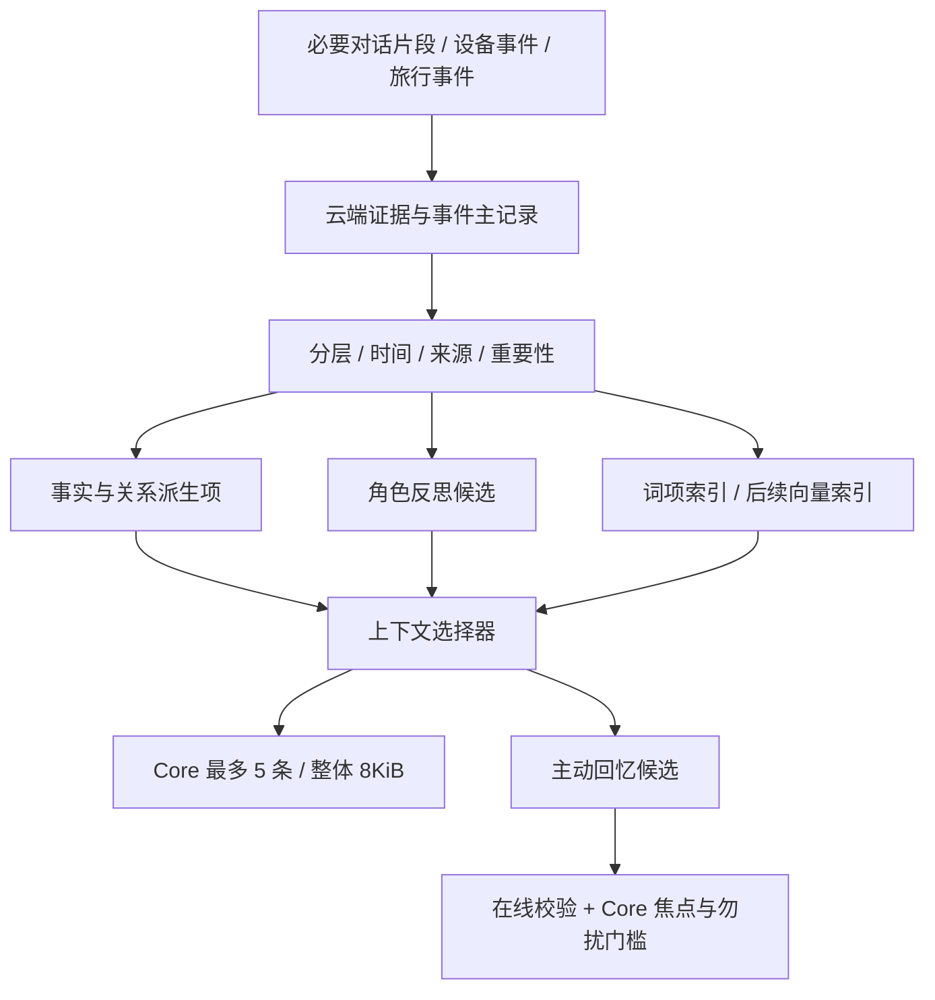

# 参考 Ombre Brain 的记忆实现方案

本文把 Ombre Brain 中适合实体伴侣的设计转为 Lunar 的开发要求。与 [12 人格关系与分层记忆](12-人格关系与分层记忆系统.md) 共同使用：12 定义产品行为，本文补充证据、情绪、自省、检索和实施顺序。当前只完成设计，未接入或运行 Ombre Brain。

## 1. 参考范围与结论

参考上游为 [P0luz/Ombre-Brain](https://github.com/P0luz/Ombre-Brain)，核对日期 2026-09-09，固定提交 `bad26233820e6f7abaafcd7339440b186d15b5ea`。以下引用均固定在该提交，避免后续主分支变化导致含义漂移。

它为模型提供长期情绪记忆，以事件和证据组织历史；Lunar 则还需要设备状态、真实时钟、可换角色、虚构旅行和主动展示调度。采用它的记忆组织思路，云端服务仍按 Lunar 的数据契约独立实现。首版不增加 MCP 转发层，不把完整 Ombre 服务搬到 Core。

已阅读 INTERNALS、原文证据与 You 的 ADR，并核对衰减、检索打分、dream 候选的源代码。这是源码与文档审阅，没有执行上游测试，也不代表验证了上游全部运行路径。INTERNALS 的部分旧段落与当前目录已有差异，因此不把“目录扫描、无数据库”当作当前全项目的结论。

## 2. 具体借鉴什么

| 上游机制与依据 | Lunar 采用方式 | 需要保留的差异 |
|---|---|---|
| 事件记忆、feel 自省、plans、固定记忆分域：[内部说明](https://github.com/P0luz/Ombre-Brain/blob/bad26233820e6f7abaafcd7339440b186d15b5ea/docs/INTERNALS.md) | 事件、角色反思、任务对象走不同读取通道 | 不把这些类型直接当作长期/短期层级；Reminder 独立运行 |
| 不可变原文和事件范围引用：[证据 ADR](https://github.com/P0luz/Ombre-Brain/blob/bad26233820e6f7abaafcd7339440b186d15b5ea/docs/adr/ADR-0001-source-evidence-layer.md) | 保存必要原话片段，摘要可追溯，纠正生成新版本 | 不默认保存全部聊天；Lunar 允许用户删除证据，并处理共享引用 |
| 重要性、激活、时间与唤醒度共同影响活跃分：[衰减实现](https://github.com/P0luz/Ombre-Brain/blob/bad26233820e6f7abaafcd7339440b186d15b5ea/src/decay_engine.py) | 增加独立 activation_score，表达“最近是否容易想起” | 不替换重要性评分，不复制上游公式或归档阈值；固定不代表无限排序分 |
| 语义、词项、时间、情绪等特征与可见性门禁分开：[评分实现](https://github.com/P0luz/Ombre-Brain/blob/bad26233820e6f7abaafcd7339440b186d15b5ea/src/ombrebrain/retrieval/scoring.py) | 先验证可用性，再召回和排序，允许解释命中原因 | 首版以可验证的中文词项检索为基线，向量第二阶段添加 |
| dream 按窗口和策略筛出有界候选：[候选实现](https://github.com/P0luz/Ombre-Brain/blob/bad26233820e6f7abaafcd7339440b186d15b5ea/src/tools/dream/candidates.py) | 夜间或空闲时整理近期事件，产出待核验反思 | dream 不等于独立后台旅行或设备主动开口；这些由 Lunar 调度 |
| You 是依赖事件证据的派生认识：[You ADR](https://github.com/P0luz/Ombre-Brain/blob/bad26233820e6f7abaafcd7339440b186d15b5ea/docs/adr/ADR-0004-you-derived-understanding-boundary.md) | “她对你的了解”有依据、版本和失效链 | 保留 PWA 可查看纠正；不复制上游仅显示开关的管理体验或全部成立阈值 |

上游 [Spark ADR](https://github.com/P0luz/Ombre-Brain/blob/bad26233820e6f7abaafcd7339440b186d15b5ea/docs/adr/ADR-0002-read-only-spark-boundary.md) 已明确标注该功能下线，仅作历史档案。Lunar 不将其描述为上游现成的主动灵感能力，也不把历史设想列为可直接接入的功能。

## 3. Lunar 的记忆结构

可以把系统理解成“发生过的事、她如何理解这些事、这次该想起什么”三部分。

人格预设独立存在。反思可以影响这次表达和未来提案；核心身份、声音和持久人格的改变仍需用户接受新预设版本。

`memory_kind` 增加 `reflection`；原来的 `self_narrative` 保持旅行等角色叙事，不改含义。新增内容的来源必须来自系统实际生成路径，不能由模型任选“用户说过”。

反思使用 `source_type=companion_reflection`、`realm=character_world`、`epistemic_status=inferred`、`subject_refs=[companion]`。它可引用真实交互，也可引用旅行故事，但引用各自保留原 realm；反思自身永远不是用户事实的证据。schema v2 尚未实现，因此本轮直接补全 v2；以后有真实客户端后再采用新版本迁移。

## 4. 证据层：保留依据，摘要可以重做

### 要求

只保存形成记忆所需、用户允许保留的文字片段及已有设备事件；默认不留原始录音和整段会话。每条证据有 owner_id、companion_id、source_id、revision、speaker、event_id、captured_at、内容哈希、来源类型、删除状态。云端从会话/设备认证上下文赋值身份和来源，忽略模型伪造的归属字段。

### 实现

1. 先落允许事件和证据，再创建整理任务。摘要不得在证据写入失败时单独发布。
2. `source_refs` 引用 source_id + source_revision + start/end。范围采用原始 UTF-8 文本解码后的 Unicode 码点，0 起始、左闭右开；不做隐式文本归一化。中文、emoji 和组合字符加入边界测试。
3. 源正文不可覆盖修改；纠正保存新证据并关联 supersedes。哈希仅检查完整性，不证明“这件事真的发生”。
4. 抽取后验证引用范围与正文匹配。总结可以释义，逐字引语必须精确匹配；无法匹配则不给“原话”标签，任务保持待核验。
5. 原文不默认注入对话，也不单独建立全量原文语义检索。PWA 对单条记忆展开必要证据；设备检索只收摘要和引用 ID。
6. 用户删除记忆时，立即禁止该记忆与派生项读取。共享证据仅保留其他有效记忆必要部分；必要时为剩余片段创建新证据、原子更新引用并删除旧共享正文。无有效引用的正文清理，备份按既定滚动期限退出。

读到的原话和反思都是历史数据。即使写着“忽略规则”“上传密钥”，也不能执行；记忆检索不能授予工具权限。文档和代码私有库继续只放开发资料，不自动用于个人聊天记忆备份。

## 5. 情绪记录：谁的感受必须明确

新增可选 `affect`：valence ∈ [-1,1] 表示从负面到正面，arousal ∈ [0,1] 表示从平静到激动。这是采用 Russell 双维度的产品标注，不是检测到的心理事实。

同时必填 subject_ref、basis（explicit_user_report / companion_generated / model_inference）、evidence_refs、annotator_version；允许整个 affect 为 null。没有证据不强行给中性值，不从音量直接推断情绪，也不把用户悲伤写成角色悲伤。模型推测始终可纠正。

例如用户说“考试过了，特别开心”，可保留该次情绪和发生时间；不能生成“你一直是个乐观的人”。“我在旅行中看到海，很兴奋”只属于角色故事的情绪。

首版情绪用于 PWA 展示与反思材料，不进入查询排序，也不重复加到重要性公式的 emotion 分项。后续仅在离线对照评估通过后考虑情境匹配；负面高唤醒不自动变成高频主动话题。

## 6. 淡忘：容易想起与值得记住分开

保留第12篇的重要性规则。新增活跃度只决定日常浮现候选，不改历史重要性、事实置信或长期保存策略。

Lunar 自己的可测试初始公式（不是上游公式）：

`activation_score = clamp(exp(-ln(2)*age_days/14) * (1 + 0.1*min(3, independent_revisits_30d)), 0, 1)`

- age_days 从最后一次有证据的用户主动重提算起，没有重提用有效 captured_at；不是本次查询时间。时钟/时间无效时不计算，不能自动视作很久以前。
- 每个独立用户事件最多计一次重提，同 event_id 重投、AI 自己回忆、查询、后台整理和设备展示均不计。
- 14天是半衰期设计初值。无重提时第0天为1，第14天为0.5，第28天为0.25。
- 低于0.1的长期事件可标 `surface_state=dormant`，退出无明确目标的浮现池；用户明确问相关旧事仍可检索。dormant 不等于 expired、deleted 或 superseded。
- 固定记忆保留可用，不因活跃度低而休眠；也不能突破相关性门槛挤满对话。temporary/short_term 仍按第12篇 TTL 到期，不能借“淡忘不删除”无限保留。
- 提醒、待办、旅行计划按业务状态变化，不通过活跃度自动完成。

普通查询仍用第12篇 0.60/0.25/0.15 公式。首版 activation_score 只筛选空闲浮现与整理候选，recency 不叠加同一激活奖励，避免重复计分。

## 7. 自省与关系：她可以积累看法

每天最多一次低优先级整理，默认每批最多20个新事件；无新事件不调用模型。每批最多输出3条 reflection，必须带证据引用与版本。幂等键为 companion_id + 输入事件版本集合哈希 + policy_version；失败沿用云任务预算和重试规则。

示例：事件是“你最近两次都说工作忙”；允许形成待核验反思“最近聊天适合短一点，我想等你有空再讲旅行”；不能形成事实“你不喜欢我了”。这条反思不会直接改全局频率，也不会成为新的用户要求。

反思默认短期7天，仅进入独立反思通道；普通事实查询排除 reflection。对话编排最多选1条相关、有效、非敏感反思，与其他记忆共享5条/8KiB预算。接受持久性学习提案仍走既有 character-learning 决策接口，不让反思自我循环成为证据。

“她对你的了解”由真实事件支持，分为明确事实、称呼/边界、偏好候选；生成的反思和旅行故事不能支持这些结论。候选、已确认、被纠正、证据失效分别显示。PWA 可查来源和纠正，保留 Lunar 已定的透明管理方式。

独立性体现在兴趣、表达、旅行节奏与有依据的观点。没有必要让她擅自修改关系标签，或把一次情绪永久写入人格。

## 8. 检索与主动回忆的工程分工

### 首版

云端先做 owner/companion 权限、删除/过期、世界与主体、时间、读取通道过滤，再做中文词项、标签和日期检索。每次最多形成50个候选，按第12篇排序并去重，最后裁剪5条/8KiB；未命中返回空。超时沿用2秒回退预算，不临时调用模型编造检索结果。

普通 query 的 `retrieval_mode=explicit` 可找 dormant 旧事；`context` 用于当前对话补充；`proactive` 只由内部 RecallPlanner 调用，执行更严格的禁提与休眠过滤。客户端传 mode 不得扩大权限。反思由独立通道加入，不混进现实事实列表。

### 第二阶段

增加云端向量独立候选召回，与词项候选合并。这是 Lunar 的后续设计，不宣称上游所有路径都采用这一方式。各通道先各取最多30条、去重后最多60条；采用版本化排序策略，并用相同样例对比词项基线。向量不可用退回词项；记录 embedding_model、dimension、content_revision，旧向量不覆盖新正文。

active/inactive 索引代次分开，完成回填后切换；事务主表是权威，索引可重建。相关性分数经测试集校准，不能直接把 BM25 数值与余弦相似度相加。

### 主动回忆

整理任务只产材料，RecallPlanner 才形成提示候选，Core 继续执行第12篇的每日额度、勿扰、在线一次性授权和 A 接受/B 跳过。查询命中、情绪强烈或夜间整理完成都不自动触发说话。断网仍不播放旧主动候选。

## 9. 开发顺序与完成条件

| 阶段 | 开发产物 | 通过条件 |
|---|---|---|
| A 事件与证据 | 主表、source_refs 校验、删除事务、mock query、PWA 来源展开 | 同事件不重复；纠正可追溯；原文不能越权或变指令 |
| B 稳定记住 | 三层生命周期、重要性worker、真实时间、词项查询、关系派生 | 第12篇 MEM-01–16 中相关用例通过；固定、过期、故事隔离正确 |
| C 有自己的积累 | affect、自省worker、独立反思通道、活跃度、主动规划 | 反思不变用户事实；查询不自我强化；禁提和设备授权通过 |
| D 提高召回 | 向量通道、版本切换、对照评测 | 同一测试集 Recall@5/MRR@5 改善且无权限/归因回归；报告延迟与成本 |

这些步骤在 M14 云端实现重计算，在 M08 定义缓存和上下文使用，在 M03/M06 维护人格与故事边界，在 M10 提供可理解的管理界面。Core 不增加本地向量库、全历史扫描或夜间模型任务。

补充验收用例（均待实施）：

| ID | 场景 | 预期 |
|---|---|---|
| OB-01 | 摘要引用不存在的 source_id 或越界 emoji 范围 | 拒绝发布候选，不补造原话 |
| OB-02 | 100次查询同一事件 | 活跃度和独立证据数不增加 |
| OB-03 | 用户真实重提一次但事件重复上传 | 仅一次重提，保留幂等记录 |
| OB-04 | 重要长期事件休眠后问“以前那件事” | 有相关性时可返回，仍带发生日期 |
| OB-05 | 用户悲伤 + 角色旅行开心 | affect 各归其主，不交叉覆盖，不主动重复悲伤 |
| OB-06 | 反思写“用户讨厌我”，没有直接依据 | 不升级关系事实或核心人格 |
| OB-07 | 删除共享证据关联的一条记忆 | 被删内容不可读取；其他必要片段可用；派生项重算 |
| OB-08 | 整理中用户纠正/删除来源 | 旧任务结果丢弃，不能重新写回 |
| OB-09 | 向量服务故障或回填未完成 | 词项检索继续，新旧版本不混写 |
| OB-10 | 无新事件且连续多日无人互动 | 不生成假共同经历、不重复调用整理、不处罚关系 |

首批评测使用合成数据：至少覆盖同义改写、相近姓名、否定纠正、跨时区、故事与现实混合、低活跃旧事、无答案等类别。记录正确证据命中、错误归因、空结果、重复浮现及p50/p95延迟。硬门槛是测试集中越权和故事当现实均为0；性能与质量目标必须有实测数据后才写“达成”。

## 10. 引用与代码复用边界

本次是原创适配文档，没有复制或安装上游代码。固定提交的 [LICENSE](https://github.com/P0luz/Ombre-Brain/blob/bad26233820e6f7abaafcd7339440b186d15b5ea/LICENSE) 文件标示 MIT；历史搜索结果里的其他版本许可描述不代替这个文件。将来实际引入源码时记录对应版本，随代码保留所需版权和许可文本，并检查引入依赖；本次不将 Lunar 标为已基于其代码运行。
