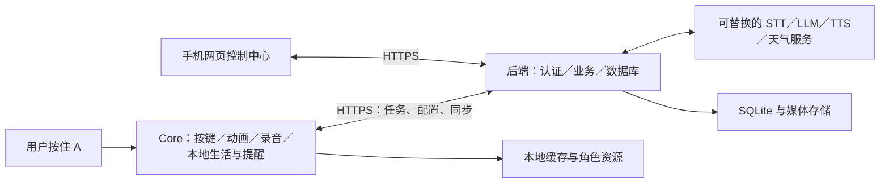

# 总体架构与实现基线

> 可选历史方案，非当前主线。请以 docs/README.md 和当前总架构为准；这里保留早期全功能后端设计，未实现。

## 1. 边界

v1.0：一个用户可管理设备，一台设备同一时间只有一个活动角色预设；支持切换预设，长期记忆属于 companion_id，换设备后可以恢复。摄像头玩法、喂养、商店、多角色同时生活、本地大模型均不在范围内。

## 2. 三端分工



手机关闭后，设备仍直接连接后端。开发期后端在电脑，电脑关闭后设备只能离线生活；部署到常在线服务器后才具有持续云能力。屏幕中的“小旅行”不代表机器人身体移动，本组合没有假定舵机或行走能力。

## 3. 建议技术选择

| 部分 | 基线 | 理由与限制 |
|---|---|---|
| 固件 | C++ / Arduino + M5Unified / M5GFX / M5Faces | 从官方示例逐步封装；精确版本经 M0 固定 |
| 屏幕 | 轻量场景绘制与局部重绘 | 首版少量页面；暂不引入复杂 GUI 框架 |
| 后端 | Python / FastAPI / Pydantic / SQLite | 单服务便于调试；多实例再迁移数据库 |
| 控制中心 | TypeScript / React / Vite，移动端响应式网页 | 首版浏览器访问；原生 BLE 配网独立里程碑 |
| 设备通信 | HTTPS REST + 异步任务轮询 | 易排错，避免首版同时维护多种实时协议 |
| 音频 | 16kHz / mono / PCM16 WAV，短句分段播放 | 是协议默认；驱动采样率不匹配由适配层重采样 |
| 云能力 | Provider 接口，Mock 和真实服务可切换 | 模型 ID、音色和服务地区待选，不锁一家 |
| 存储 | 后端 SQLite + 私有媒体目录；设备 NVS + microSD | microSD 可缺省降级，但离线媒体数量有限 |

上述是工程决策，不是声称已实现。M0 若工具链不满足驱动，先调整 HAL 和构建配置，不重写业务。参考 [资料清单](07-待确认事项与资料来源.md)。

## 4. 目标代码目录（尚待创建）

```text
firmware/
  src/hal/            屏幕、输入、音频、电源、时钟
  src/core/           状态机、事件总线、资源仲裁
  src/features/       生活、对话、提醒、翻译、回忆
  src/services/       网络、存储、配置、升级
  tests/              不依赖硬件的规则测试
backend/
  app/api/            路由、认证、输入输出结构
  app/services/       会话、提醒、小旅行、同步
  app/providers/      模型与天气适配
  app/storage/        数据库及迁移
  tests/              API、规则、数据隔离测试
control-center/
  src/pages/          六个管理模块
  src/api/            客户端与错误处理
assets/characters/    角色资源源文件与发布清单
contracts/           实现后导出的 OpenAPI 与 JSON Schema
tools/               资源转换与诊断工具
docs/                本文档集
```

不要提交 `.env`、设备令牌、用户音频、私有数据库。示例使用虚构账号与数据。代码创建时增加对应 `.gitignore`。

## 5. 执行与存储原则

- UI、输入、音频和联网拆开；请求超时不能冻结表情或吞掉松键。
- 本地生活由时钟与规则驱动；AI 只生成可校验的内容。
- 角色配置以版本化数据发布，业务代码不得写死 Lunar 名称或素材路径。
- 后端执行工具动作并持久化成功后才能告诉用户“已经做好”。提醒还必须区分已存云端与已同步设备。
- 所有记忆检索携带来源；虚构故事不能转换成 Profile 事实。
- 所有量化值均为初始测试目标，变更后同步接口、测试和模块文档。

## 6. 主要资源预算（建议上限）

320×240 RGB565 一帧约 150KiB，双缓冲约 300KiB。16kHz 单声道 PCM16 每秒约 32,000 字节，20 秒约 625KiB；采集最大 20 秒。实际可用 PSRAM 少于标称容量，TLS、音频和显示要一起测。

优先逐帧加载动画、分段下载声音，避免一次装入所有素材。建议资源包首轮 ≤ 8MiB，译文图片单页 ≤ 150KiB，响应正文 ≤ 64KiB；超过由服务端分页或拒绝。此预算不是存储分区表。Flash 必须给双 OTA 分区和恢复资源留位置，见 M11。

## 7. 公共行为约定

页面切换前取消当前录音和播放；按键必须松开后才能触发新页面。提醒到达先排队，录音最长 20 秒后释放焦点。离线显示缓存时带时间，不伪装成最新。网络恢复只同步待发送操作，不补播旧对话，也不批量生成离线期间的旅行。
